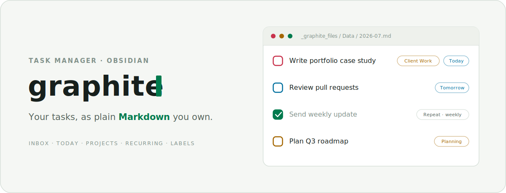

<div align="center">

<picture>
  <source media="(prefers-color-scheme: dark)" srcset="docs/assets/cover-dark.svg" />
  
</picture>

<br/>

A calm, Todoist-like task manager for Obsidian — every task is a line in a plain Markdown file you own. No account, no external service, no database. Just your notes.

<br/>

[](LICENSE)
&nbsp;
&nbsp;

[Website](https://real-fruit-snacks.github.io/Graphite/) · [Changelog](CHANGELOG.md) · [Report an issue](https://github.com/Real-Fruit-Snacks/Graphite/issues)

</div>

---

## Overview

Graphite sits between lightweight checkbox plugins and heavy task-note systems: structured enough to run your day, small enough to stay quiet. Tasks live entirely inside your vault as human-readable Markdown, organized into one file per month — so your task history is greppable, portable, and yours forever.

> Graphite is **not** a Todoist integration. It never connects to Todoist or any external service.

---

## Features

- **Views** — Inbox, Today (with an Overdue section), Upcoming, Projects, Filters & Labels, Activity (with a 26-week heatmap), Completed, and Search.
- **Tasks** — titles, descriptions, projects, priorities (P1–P4), due dates, deadlines, labels, and file attachments with inline image previews.
- **Sub-tasks** — nested under any task, with an inline completion counter and quick complete.
- **Recurring tasks** — daily, weekly (multi-weekday), weekdays, monthly, yearly, and custom rules; calendar- or completion-based.
- **Quick capture** — add from the board, a full-screen mobile composer, or the command palette (with `#label` and `//project` inline tokens).
- **Daily Notes** — surface a day's completed tasks in a panel or a `graphite-completed` code block.
- **Confirm before delete** — task and sub-task deletions always ask first.
- **Theme-driven** — colors, surfaces, and accents inherit from your active Obsidian theme; the UI speaks the [Terminal Workbench](https://github.com/Real-Fruit-Snacks/terminal-workbench-design-system) design language.
- **Private** — no telemetry, no network calls, no account.

---

## Installation

### Community plugins

> Not yet listed in the Obsidian community catalog. Use BRAT or a manual install for now.

### BRAT (beta)

1. Install the **BRAT** plugin from Community plugins.
2. Run **BRAT: Add a beta plugin** and enter `Real-Fruit-Snacks/Graphite`.
3. Enable **Graphite** in Settings → Community plugins.

### Manual

1. Download `main.js`, `manifest.json`, and `styles.css` from the [latest release](https://github.com/Real-Fruit-Snacks/Graphite/releases).
2. Copy them into `<your-vault>/.obsidian/plugins/graphite/`.
3. Reload Obsidian and enable **Graphite** in Settings → Community plugins.

---

## Getting started

1. Run **`Graphite: Open`** from the command palette (or click the ribbon icon).
2. Click **+ Add task**, or press the Quick Add hotkey, and give it a title.
3. Add a date, project, label, priority, or repeat rule. Tasks with no project land in **Inbox**.

### Commands

| Command | Default hotkey |
|---|---|
| `Graphite: Open` | — |
| `Graphite: Quick Add Task` | `Ctrl`/`Cmd` + `Shift` + `A` |
| `Graphite: Show Completed Tasks for Active Daily Note` | — |
| `Graphite: Insert Completed Tasks Block in Active Daily Note` | — |
| `Graphite: Normalize Labels` | — |
| `Graphite: Migrate old task file` | — |

### Inline tokens

While typing a task title, use `#label` to attach a label and `//project` to set the project.

---

## How a task is stored

Graphite keeps task data in a configurable folder (default `_graphite_files/`), one Markdown file per month, with attachments beside them:

```text
_graphite_files/
├─ Data/
│  └─ 2026-07.md
└─ Attachments/
   └─ <task-id>/
```

Each task is a Markdown list item with `key:: value` metadata:

```markdown
- [ ] Write portfolio case study draft
  id:: task-example
  created:: 2026-07-05
  due:: 2026-07-08
  deadline:: 2026-07-10
  project:: Client Work
  priority:: P2
  description:: Keep it short and visual.
  labels:: writing, portfolio
```

Tasks without a project omit `project::` and appear in Inbox. Completed tasks use `[x]` with a `completed::` date. Graphite reads and writes **only** its own data folder, and preserves any lines or properties it doesn't recognize — so hand-editing is safe.

---

## Architecture

```text
src/
├─ main.ts          Plugin lifecycle, commands, events, Daily Notes
├─ taskStore.ts     In-memory task state + queued Markdown persistence
├─ parser.ts        Markdown → tasks (preserves unknown content)
├─ serializer.ts    Tasks → Markdown (non-destructive round-trip)
├─ repeatUtils.ts   Recurring-task scheduling
├─ views/           Board view, detail modal, composer, project/label modals
└─ ui/              Shared components (themed dropdown, buttons, icons, popover)
```

- **Non-destructive storage** — the parser keeps a document of raw + task blocks, so edits never clobber surrounding content or unknown metadata.
- **Serialized writes** — task writes run through a queue and reconcile only the files they touch, so rapid, cross-file edits can't race or drop data.
- **Theme-driven styling** — namespaced `.graphite-*` CSS with tokens mapped to Obsidian's theme variables; monospace "manifest" labels for structural chrome.

The pure data layer (parser, serializer, recurring math, sorting, store) is covered by a [Vitest](https://vitest.dev) suite.

---

## Development

```bash
npm install
npm run dev      # watch build
npm run test     # data-layer test suite
npm run verify   # tests + typecheck + production build (pre-commit gate)
```

To auto-copy each build into a vault's plugin folder, set the `GRAPHITE_PLUGIN_DIR` environment variable or a gitignored `.plugin-target` file to that folder's path.

---

## Contributing

Bug reports and feature requests are welcome in [Issues](https://github.com/Real-Fruit-Snacks/Graphite/issues). If you're opening a pull request, run `npm run verify` first.

---

## Credits

Graphite is a fork of the [belki](https://github.com/aribuga/obsidian-belki-tasks) task manager by Yasin Aribuga, rebuilt and extended under the [Terminal Workbench](https://github.com/Real-Fruit-Snacks/terminal-workbench-design-system) design language.

## License

MIT — see [LICENSE](LICENSE). Copyright © Yasin Aribuga (original belki project) and Real-Fruit-Snacks (Graphite fork).
